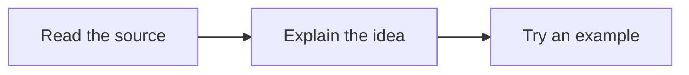

# Manta Diagrams

[English](README.md) · [한국어](README.ko.md)

Read Mermaid diagrams with Manta's layout directly in your notes. Make room for long labels, open a focused viewer and save an SVG without changing the source note.

**[User guide](docs/user-guide.md) · [Roadmap](ROADMAP.md)**

Version **0.1.0** · Obsidian **1.13.0+** · Desktop. Release candidate. Obsidian runtime verification and Community submission are in progress.

## Start with a diagram

The Obsidian release is still being checked. For a local development build:

1. Run the development commands below, then copy `main.js`, `manifest.json` and `styles.css` into `.obsidian/plugins/manta-diagrams/`. Enable **Manta Diagrams** in a test vault’s Community plugins.
2. Keep a normal Mermaid block in your note. Manta displays the diagram in Reading view and Live Preview without changing its source.
3. Select **Open diagram**, or run **Manta Diagrams: Open diagram under cursor**. Use **Fit**, **Reading size**, drag or zoom to inspect it. **Save SVG** exports the full diagram.

````markdown

````

The note body and focused viewer share the same renderer. **Original view** compares the original rendering without editing the note. The command also accepts a selected diagram. Disabling Manta returns ordinary `mermaid` blocks to Obsidian when the note is rendered again.

<picture>
  <source media="(prefers-color-scheme: dark)" srcset="docs/assets/manta-diagrams-intro-dark.gif">
  
</picture>

A six-second loop of the actual renderer: the source keeps the same nodes and connections while the layout changes. Timing is condensed.

## Choose a layout when it helps

Ordinary supported diagrams use Manta's document styling. Add `%% layout: loop` to a Mermaid flowchart for a circular layout. Use a `manta` fence to embed the full viewer directly in a note. The source remains editable text.

Authored styling and links stay with bundled Mermaid; JavaScript callbacks are disabled. If Manta cannot represent an input, it tries standard Mermaid and explains the fallback. An invalid diagram shows the source and an error rather than an old result. ER diagrams use a compact horizontal layout unless the source specifies a direction.

Everything runs locally. The plugin does not write notes, call an AI service or load its renderer from a CDN. [Compatibility and limits](docs/user-guide.md#compatibility) · [Verification record](docs/validation.md)

## A few useful views of the same work

Use [Manta Graph](https://github.com/woonyong-choi/manta-graph) to follow the supporting notes, [Manta Code Blocks](https://github.com/woonyong-choi/manta-code-blocks) to try the example and [Manta Calendar](https://github.com/woonyong-choi/manta-calendar) to return to a dated review. Each plugin works on its own; notes and links connect the work today.

**Manta itself is in development and has not been released.** I’m building it to turn source material into a personal wiki you can keep adding to. Shared AI tools and automatic handoffs between the four plugins are planned. [Roadmap](ROADMAP.md)

## Development

```sh
npm ci --ignore-scripts
npm test
npm run build
npm run verify:release
```

The viewer preserves the note source and shares its renderer with the media fixtures. Special layout tests cover 31 basic, 31 complex and 31 error cases, plus 10 legacy aliases. Automated checks do not establish visual quality for every possible Mermaid input. [Renderer details](docs/renderer.md) · [Demo source](demo/README.md)

[Report a problem](https://github.com/woonyong-choi/manta-diagrams/issues) · [MIT](LICENSE) · [Third-party notices](docs/third-party-notices.txt)
