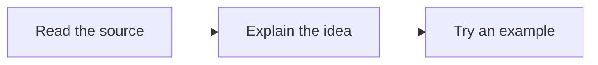
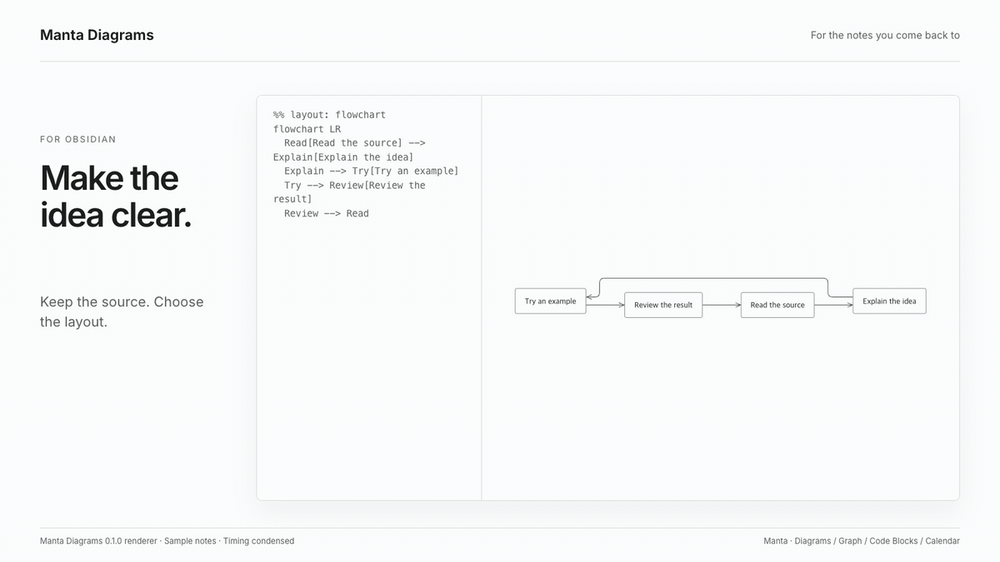

# Manta Diagrams

[English](README.md) · [한국어](README.ko.md)

Read Mermaid diagrams in a focused viewer. Make room for long labels, follow a connection and save an SVG without changing the source note.

**[Try your Mermaid](https://woonyong-choi.github.io/manta-diagrams/try/) · [User guide](docs/user-guide.md)**

Version **0.1.0** · Obsidian **1.13.0+** · Desktop. Release candidate. Obsidian runtime verification and Community submission are in progress.

## Start with a diagram

The browser demo is available now. The Obsidian release is still being checked. For a local development build:

1. Run the development commands below, then copy `main.js`, `manifest.json` and `styles.css` into `.obsidian/plugins/manta-diagrams/`. Enable **Manta Diagrams** in a test vault’s Community plugins.
2. Keep a normal Mermaid block in your note. Put the cursor inside it.
3. Run **Manta Diagrams: Open diagram under cursor**. Use **Fit**, **Reading size**, drag or zoom to inspect it. **Save SVG** exports the full diagram.

````markdown

````

The original Mermaid block keeps Obsidian’s renderer. Manta adds a viewer button when the rendered block can be mapped back to its source. The command also accepts a selected diagram.



[Watch the 60fps introduction](docs/assets/manta-diagrams-intro.mp4). This is an animated presentation of actual Manta renderer output, not a recording of mouse interactions.

## Choose a layout when it helps

Add `%% layout: loop` to a Mermaid flowchart for a circular layout, or `%% layout: flowchart` for Manta’s document styling. Use a `manta` fence to embed the viewer directly in a note. The source remains editable text.

Ordinary diagrams use bundled Mermaid. Authored styling and links stay with Mermaid; JavaScript callbacks are disabled. If a special layout cannot represent an input, the viewer tries standard Mermaid and explains the fallback. An invalid diagram shows the source and an error rather than an old result.

Everything runs locally. The plugin does not write notes, call an AI service or load its renderer from a CDN. [Compatibility and limits](docs/user-guide.md#compatibility) · [Verification record](docs/validation.md)

## A few useful views of the same work

Use [Manta Graph](https://github.com/woonyong-choi/manta-graph) to follow the supporting notes, [Manta Code Blocks](https://github.com/woonyong-choi/manta-code-blocks) to try the example and [Manta Calendar](https://github.com/woonyong-choi/manta-calendar) to return to a dated review. Each plugin works on its own; notes and links connect the work today.

**Manta itself is in development and has not been released.** I’m building it to turn source material into a personal wiki you can keep adding to. Shared AI tools and automatic handoffs between the four plugins are planned. [Meet the Manta family](https://woonyong-choi.github.io/manta-diagrams/manta/) · [Roadmap](ROADMAP.md)

## Development

```sh
npm ci --ignore-scripts
npm test
npm run build
npm run verify:release
npm run build:site
```

The Obsidian plugin and browser demo use the same viewer and rendering adapter. Special layout tests cover 31 basic, 31 complex and 31 error cases, plus 10 legacy aliases. Automated checks do not establish visual quality for every possible Mermaid input. [Renderer details](docs/renderer.md) · [Demo source](demo/README.md)

[Report a problem](https://github.com/woonyong-choi/manta-diagrams/issues) · [MIT](LICENSE) · [Third-party notices](docs/third-party-notices.txt)
