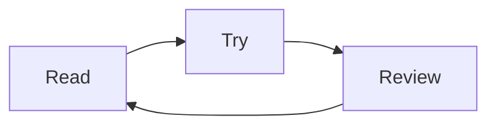

# Using Manta Diagrams

## Open a diagram

Keep a normal `mermaid` fence. Supported inputs use Manta in Reading view and Live Preview. Select **Open diagram** on the diagram, or place the editor cursor inside the block and run **Open diagram under cursor**. A complete selected fence or selected Mermaid source also works. The note body and full viewer share the same renderer.

An optional `manta` fence renders the viewer inside the note. A standard Markdown reader may treat this as a code block, so keep `mermaid` fences when portability is more useful.

## Read and export

- **Fit** shows the complete structure. Large diagrams may have small labels at this scale.
- **Reading size** is the default: one CSS pixel per diagram unit. Drag to reach other parts.
- Drag to move, or focus the diagram and use arrow keys. `+` and `-` zoom; `0` fits.
- Ctrl/Command + wheel zooms. Ordinary scrolling remains available for the note.
- **Mermaid source** opens the original text for inspection.
- **Save SVG** saves the complete diagram in the current theme, independent of the current pan or zoom.

## Layout comments

````markdown

````

A `%% layout:` hint selects a particular Manta layout. **Original view** compares a successful Manta rendering with standard Mermaid; **Document view** returns to Manta. This toggle is not shown for diagrams already using the standard renderer.

[Examples](../src/examples.mjs) list the available experimental layouts. Loop, layers and pyramid need a connected path; Venn accepts 2–3 sets; swimlanes need acyclic owner-scoped paths. When a layout does not fit the input, standard Mermaid is attempted and the source is preserved.

## Compatibility

The first release targets Obsidian desktop 1.13.0+. Mobile Obsidian is not supported by this release. A responsive browser preview is not a substitute for testing the mobile app.

Standard diagrams use Mermaid 11.17.2 with strict security. Authored styles, links and directives use the standard renderer. JavaScript click callbacks are never bound. HTTPS, mail and Obsidian note-opening links (`obsidian://open?...`) are user-activated; other custom protocols are not supported. Complex HTML labels may be limited by the host sanitizer; missing labels or links are reported as a rendering error.

The tested mindmap `::icon(fa fa-book)` retains its node text and relationships, but its book icon is currently not drawn. External icon assets are not fetched.

The viewer accepts up to 50,000 source characters and standard Mermaid accepts up to 500 edges. Large diagrams can still take time to lay out; splitting them into smaller sections improves readability. There is no guarantee for every Mermaid extension or combination of plugins and themes.

While enabled, the plugin handles ordinary `mermaid` note blocks. Disabling it returns those blocks to Obsidian when the note is rendered again. It does not rewrite notes, execute diagram callbacks or call remote services. SVG saving uses a browser download chosen by the user. Renderer dependencies are bundled.
